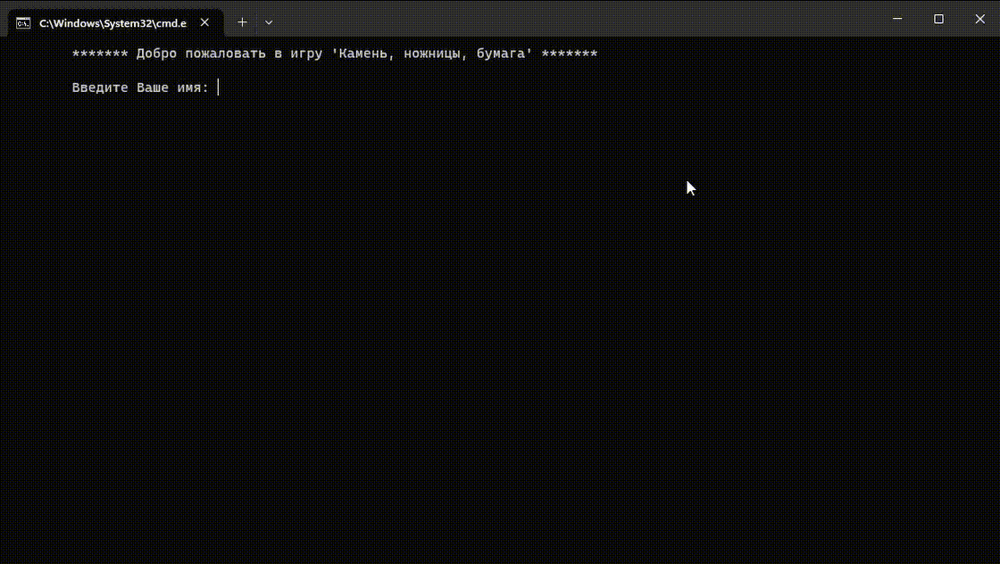

# Проект Rock_scissors_paper

## Оглавление  
[1. Описание проекта](README.md#Описание-проекта)  
[2. Что интересного?](README.md#Что-интересного?)  
[3. Ход работы](README.md#Ход-работы)  
[4. Результат](README.md#ЭРезультат)

### Описание проекта    
Игра "Камень, ножницы, бумага" с визуальной частью в консоли.  В роли противника выступает компьютер

### Что интересного?
- Упрощенная визуальная часть приожения
- Меню управления в проекте
- Подсчет статистики: промежуточная и итоговая
- Немного юмора

### Ход работы
- Пользователь вводит свое имя<
- Выберает команду в меню управления
- Начинается матч (3 раунда)
- Вывод результата

### Результат
Игра работает стабильно и без вылетов.  Так же [py-файл](main.py) преобрахован в исполняемы [файл exe](dist/Rock_scissors_paper.exe)

Если информация по этому проекту покажется вам интересной или полезной, то я буду очень вам благодарен, если отметите репозиторий и профиль ⭐️⭐️⭐️-дами
